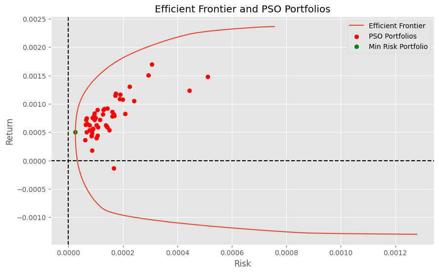

# Particle Swarm Optimization for Portfolio Optimization

## Overview

This repository contains the implementation of a Particle Swarm Optimization (PSO) algorithm for solving the Cardinality Constrained Markowitz Portfolio Optimization (CCMPO) problem. The project is based on the paper "Enhancing Particle Swarm Optimization for Portfolio Optimization" by Deng, Lin, and Lo (2012).

## Introduction

The goal of this project is to optimize a financial portfolio using PSO. PSO is a computational method inspired by the social behavior of birds, where each particle in the swarm represents a potential solution. This project specifically addresses the Cardinality Constraints in the Markowitz Portfolio Optimization problem, aiming to minimize risk for a given level of return or maximize return for a given level of risk.

## Features

- Implementation of an advanced PSO.
- Portfolio optimization with cardinality, budget, and holdings constraints.
- Handling boundary and cardinality constraints using reflection strategy and proportional value adjustments.
- Analysis and test on the results

## Dataset

The experiments use data from S&P 500 (USA) from 01-02-2014 to 31-12-2021: from 2014 to 2018 for train and compute efficient frontier and the pso, from 2019 to 2021 for testing.
There is an automatic outlier returns remover in the script to get a more robust benchmark in efficient frontier calculation.

## Results

This figure illustrates the performance comparison between the Efficient Frontier and Particle Swarm Optimization (PSO) results for portfolio optimization.

- Efficient Frontier: The curve shows the theoretical boundary of optimal portfolios. Portfolios on the curve are considered efficient because they provide the maximum possible return for a given level of risk.

- PSO Results: The red dots are close to the Efficient Frontier, suggesting that the proposed PSO algorithm is effective in finding near-optimal portfolio solutions. The spread of red dots shows the diversity and robustness of the PSO algorithm in exploring the solution space.

This comparison demonstrates the efficacy of the enhanced PSO algorithm in portfolio optimization, highlighting its ability to generate a set of solutions that closely align with the theoretical optimal portfolios.